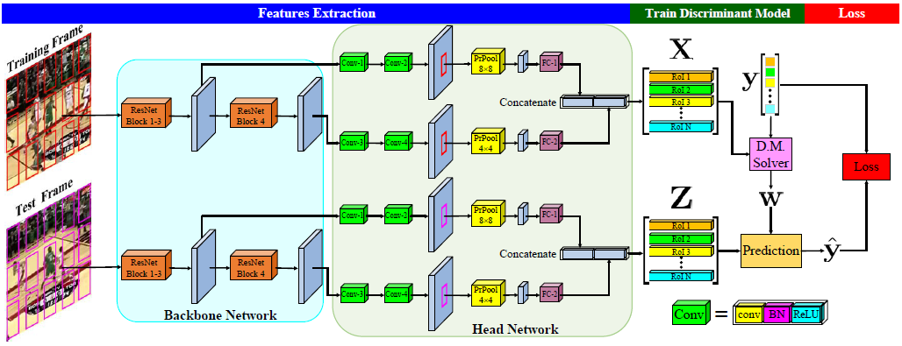

# DCFST
Learning Feature Embeddings for Discriminant Model based Tracking (Accepted by ECCV2020):


## Abstract
After observing that the features used in most online discriminatively trained trackers are not optimal, in this paper, we propose a novel and effective architecture to learn optimal feature embeddings for online discriminative tracking. Our method, called DCFST, integrates the solver of a discriminant model that is differentiable and has a closed-form solution into convolutional neural networks. Then, the resulting network can be trained in an end-to-end way, obtaining optimal feature embeddings for the discriminant model-based tracker. As an instance, we apply the popular ridge regression model in this work to demonstrate the power of DCFST. Extensive experiments on six public benchmarks, OTB2015, NFS, GOT10k, TrackingNet, VOT2018, and VOT2019, show that our approach is efficient and generalizes well to class-agnostic target objects in online tracking, thus achieves state-of-the-art accuracy, while running beyond the real-time speed.

## Tracking performance
DCFST is a simple yet effective tracker. This project provides the training and test codes of DCFST. It can reproduce the accuracy on the following six popular tracking benchmarks reported in the paper. Note that, DCFST-18 and DCFST-50 are DCFST with ResNet-18 and DCFST-50 backbone, respectively.

### Results on Popular challenging benchmarks
| Dataset    |  OTB2015 |  NfS  | TrackingNet | GOT10k |
|------------|----------|-------|-------------|--------|
|DCFST-18    |   70.9%  | 63.4% |    73.9%    |  61.0% |
|DCFST-50    |     -    | 64.1% |    75.2%    |  63.8% |

### Results on VOT benchmarks
| Dataset    |  VOT2018 | VOT2019 | VOT2019 Real-Time |
|------------|----------|---------|-------------------|
|DCFST-18    |   41.6%  |  36.1%  |       31.7%       |
|DCFST-50    |   46.0%  |    -    |         -         |

## Pretrained Models
```
The model of DCFST-18: https://drive.google.com/file/d/1MdTSAEOlsb-MK4VsWM9RuT7ed_FIvDQf/view?usp=sharing
The model of DCFST-50: https://drive.google.com/file/d/12Ctc6oBz52CO6NyCWFOp3rrCxStILrzM/view?usp=sharing
```
Then, you need to move the models to './DCFST/pytracking/networks/'

## Installation
Thanks for the handsome work, ATOM, by Martin Danelljan. This project is highly based on pytracking. Particularly, it is based on the early version (pytorch 0.4.1) of pytracking (https://github.com/visionml/pytracking/tree/pytorch041). Therefore, if there are any missing documents and operation descriptions due to my carelessness, please refer to the corresponding section in pytracking.

## Requirements
```
Intel(R) Xeon(R) CPU E5-2630 v4 @ 2.20GHz CPU
TITAN X(Pascal) OR TITAN 1080Ti GPU
CUDA 8.0
numpy 1.16.2
numpy-base 1.16.2
python 3.7.3
torchvision 0.2.1
pytorch 0.4.1
opencv-python 4.0.1.24
```

I have writed them into the install.sh, just run it!

*** NOTE *** I have tried my best to let everyone enjoy the above accuracy of DCFST accurately. The ATOM in pytracking is stochastic. In order to eliminate the randomness as much as possible, I make a small change to ATOM. For users, please ensure that the versions of softwares and environments you used are the same as above. There may be more version requirements and those are all I can think of so far.

## Install Precise ROI pooling module

Sure, like in pytracking, you also need to download the pytorch0.4.1 version of Precise ROI pooling, and place it in DCFST/ltr/external/PreciseRoIPooling/, and complie it.

## RUN
Running the following commonds to get the corresponding results.

Please make sure that the running.py and tracker.py files in ./DCFST/pytracking/evaluation/ is for non-VOT challenge. (See below section.)
```
python run_tracker.py sbdt GOT10k --dataset 'gott'
python run_tracker.py sbdt NfS --dataset 'nfs'
python run_tracker.py sbdt OTB2015 --dataset 'otb'
python run_tracker.py sbdt TrackingNet --dataset 'tn'
python run_tracker.py sbdt50 GOT10k --dataset 'gott'
python run_tracker.py sbdt50 TrackingNet --dataset 'tn'
```

## VOT RUN
When you would like to run VOT2018 or VOT2019, please manually change the following two places. (In fact, it can be more convenient, but I am too lazy to improve it.)

./DCFST/pytracking/evaluation/running.py
```
#run_sequence(seq, tracker_info, debug=debug) #except VOT
run_sequence_vot(seq, tracker_info, debug=debug) #VOT challenge
```
./DCFST/pytracking/evaluation/tracker.py
```
#output_bb, execution_times = tracker.track_sequence(seq) #except VOT
output_bb, execution_times = tracker.track_sequence_vot(seq) #VOT challenge
```
Running the following commonds to get the corresponding results.
```
python run_tracker.py sbdt VOT19 --dataset 'vot19'
python run_tracker.py sbdt50 VOT18 --dataset 'vot18'
```

Then, the output format of VOT Challenge will be generated.

## Results
```
The raw results of DCFST-18 can be obtained by https://drive.google.com/file/d/10UckXO23od7hPFdhOECCxOY2XXMpG_4M/view?usp=sharing
The raw results of DCFST-50 can be obtained by https://drive.google.com/file/d/1jaBROl8jCKT0mechTJ76DKlqmp2tjroR/view?usp=sharing
```

## About SBDT
Please don't be confused by what I call the DCFST as SBDT in the code. In fact, I originally named the article of this work as "A Siample Baseline for Deep Tracking", thus I write code with the algorithm name SBDT. DCFST was the later changed article title and algorithm name, however, I do not change the name from SBDT to DCFST in the code overall, probably because I am lazy.

## Advice
There are little differences between DCFST-18 tracker file and DCFST-50 tracker file. In fact, DCFST-18 tracker file, that is './DCFST/pytracking/tracker/sbdt/sbdt.py', was written casually in a hurry. In order to be as beautiful and logical as possible, I wrote DCFST-50 tracker file, that is './DCFST/pytracking/tracker/sbdt50/sbdt.py' afterwards. So, the DCFST-18 tracker file is only used to reproduce the reported tracking results of DCFST-18. If you are interested in reading or following this code, just pay attention to the DCFST-50 tracker file and feel free to discard the DCFST-18 tracker file.

## Citation
If you find this project useful for your research, please use the following BibTeX entry.

```
@InProceedings{zheng2020DCFST,
author = {Zheng, Linyu and Tang, Ming and Chen, Yingying and Wang, Jinqiao and Lu, Hanqing},
title = {Learning Feature Embeddings for Discriminant Model based Tracking},
booktitle = {Proceedings of the European Conference on Computer Vision (ECCV)},
month = {August},
year = {2020}
}
```
